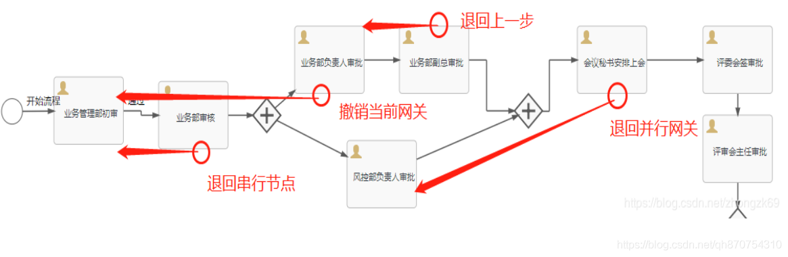

# flowable驳回/退回上一步/退回到


## 一、驳回/退回上一步/退回到（历史某一个节点）
```text
我们经常需要工作流中退回上一步，或者退回历史某一个节点。但由于流程的场景是很复杂的，回退有以下一些场景：
```

1.串行路线上的退回：流程中没有任何网关（排他网关/并行网关）和会签多实例。

2.退回到并行网关分支中的某一个节点上：

3.并行网关中的某一个分支节点上发起退回，退回到并行网关前面的某一个节点上

4.子流程中退回到主干流程中某一个节点/主干流程退回到子流程中某一个节点。

如下图：


## 二、flowable实现：

1.普通串行路线上的退回（此流程中没有并行网关的退回时），此方法支持普通串行节点/会签多实例节点/排他网关节点：
```java
runtimeService.createChangeActivityStateBuilder()
        .processInstanceId(proInstanceId)
        .moveActivityIdsToSingleActivityId(curTaskKeys, targetTaskKey)
        .changeState();
        或者
        moveActivityIdTo(String currentActivityId,String newActivityId)；
```

2.并行网关中发起退回（即撤销当前的网关）,这个地方不能用moveActivityIdTo(String currentActivityId,String newActivityId)；是因为当某一个分支完成，它的is_active为0，另一条分支没有完成时。这时候这个方法是取不到所的分支的key的，它只有is_active为1的key能取到，不然就会造成多一条垃圾数据，同时再走并行时，任何一个分支不会等另一个分支就完走到分支的合并节点上，这就是bug，所以要改为以下方法：
```java
// 并行网关的退回
List currentExecutionIds = new ArrayList<>();
List executions = runtimeService.createExecutionQuery().parentId(proInstanceId).list();
for (Execution execution : executions) {
    System.out.println(“并行网关节点数：”+execution.getActivityId());
    currentExecutionIds.add(execution.getId());
}
runtimeService.createChangeActivityStateBuilder()
    .moveExecutionsToSingleActivityId(currentExecutionIds, targetTaskKey)
    .changeState();
```
3.退回到并行网关中的某一个节点：经试验退回时必须同时退回并行网关中的所有分支。
```java
List targetTaskKeys = new ArrayList<>();
targetTaskKeys.add(“sid-CA74ADED-7E70-451D-951C-95988BFC3F07”);
targetTaskKeys.add(“sid-7922C598-74FD-4848-95AC-D9790AF68432”);

runtimeService.createChangeActivityStateBuilder()
    .processInstanceId(proInstanceId)
    .moveSingleActivityIdToActivityIds(“sid-CAD50E6F-7E0C-437D-816B-DDBA1A976A79”, targetTaskKeys)
    .changeState();
```
4.主干流程和子流程的退回（没有试验过），官方提供了以下方法：
```java
moveActivityIdToParentActivityId(String currentActivityId, String newActivityId)
moveActivityIdToSubProcessInstanceActivityId(String currentActivityId, String newActivityId, String callActivityId)
moveActivityIdToSubProcessInstanceActivityId(String currentActivityId, String newActivityId, String callActivityId,Integer subProcessDefinitionVersion)
```
原文链接：https://blog.csdn.net/zhongzk69/article/details/90740662