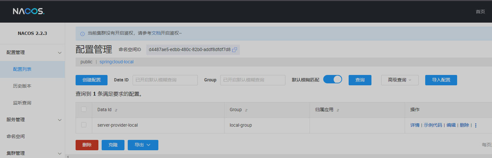

# nacos配置
[Nacos-discovery配置](https://github.com/alibaba/spring-cloud-alibaba/wiki/Nacos-discovery)  
[Nacos-config配置](https://github.com/alibaba/spring-cloud-alibaba/wiki/Nacos-config)  

## docker安装
1. 创建docker network
```text
docker network create my_net
```
2. 数据库安装
```text
docker run -d --restart=always -p 3306:3306 --privileged=true --network=my_net
    -v /home/docker/mysql8/log:/var/log/mysql 
    -v /home/docker/mysql8/data:/var/lib/mysql 
    -v /home/docker/mysql8/conf:/etc/mysql/conf.d 
    -e MYSQL_ROOT_PASSWORD=tiger -e TZ=Asia/Shanghai --name MtgMysql mysql:8.0.26
```
3. nacos安装 
> web访问地址：http://127.0.0.1:8848/nacos  
> 账号密码：nacos
```text
docker run -d -p 8848:8848 -p 9848:9848 
    --network=my_net -e MODE=standalone 
    -e PREFER_HOST_MODE=hostname 
    -e SPRING_DATASOURCE_PLATFORM=mysql 
    -e MYSQL_SERVICE_HOST=mysql8 
    -e MYSQL_SERVICE_PORT=3306 
    -e MYSQL_SERVICE_USER=root 
    -e MYSQL_SERVICE_PASSWORD=tiger 
    -e MYSQL_SERVICE_DB_NAME=nacos 
    --name nacos nacos/nacos-server:v2.2.3
```

