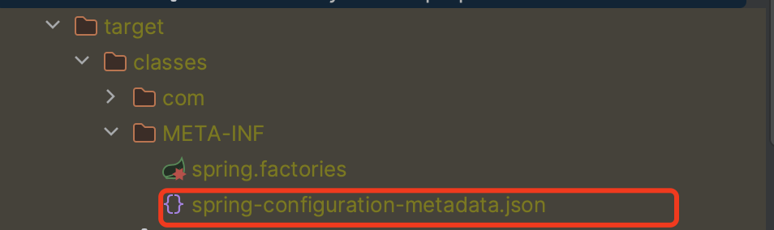

# spring-security-server项目

整合vue3、redis、jwt的前后端分离项目可在主页查看【前后端分离项目】。  
文档资料：http://t.csdnimg.cn/SPM7K。  
源码地址：https://gitee.com/stt0626/stt-study.git  
原创不易，喜欢的朋友记得点点关注哦！

>- 基于请求的：在配置文件中配置路径，可以使用**的通配符
>- 基于方法的：在方法上使用注解
>- 动态权限的：在数据库中配置权限，权限更新后自动刷新

## 请求级别和方法级别对比
如果方法上也定义了权限，则会覆盖类上的权限；
使用注解方式，未注解的方法安全，需要在HttpSecurity实例中声明兜底授权规则。



## 基于请求的
SecurityConfig.kt配置类：
```kotlin
@Configuration
@EnableWebSecurity(debug = true)
class SecurityConfig {
    // 密码加密器
    @Bean
    fun passwordEncoder(): PasswordEncoder {
        return PasswordEncoderFactories.createDelegatingPasswordEncoder()
    }

    // 自定义用户名和密码
    @Bean
    fun userDetailsService(passwordEncoder: PasswordEncoder): UserDetailsService {
        var user1 = User.withUsername("admin")
            .password(passwordEncoder.encode("tiger"))
            .roles("admin", "user")
            .authorities("test:show")
            .build()
        var user2 = User.withUsername("gjw")
            .password(passwordEncoder.encode("tiger"))
            .roles("user")
            .build()
        return InMemoryUserDetailsManager().apply {
            createUser(user1)
            createUser(user2)
        }
    }

    // 定义一个过滤器链，该链能够与 HttpServletRequest. 匹配，以确定它是否适用于该请求
    @Bean
    fun securityFilterChain(http: HttpSecurity): SecurityFilterChain {
        // 关闭csrf机制
        http.csrf { it.disable() }
        // 配置拦截方式-基于请求的授权
        http.authorizeHttpRequests { auth ->
            // to_login 接口允许任意访问（未登录也可访问）
            auth.requestMatchers("/to_login").permitAll()
                // has_admin 接口，登陆用户必须有 admin 角色
                .requestMatchers("/has_admin").hasRole("admin")
                // has_any 接口，登陆用户必须有 admin 或 user 角色
                .requestMatchers("/has_any").hasAnyRole("admin", "user")
                // has_authority 接口，登陆用户必须有 'test:show' 权限
                .requestMatchers("/has_authority").hasAuthority("test:show")
                // 其他请求 登陆即可访问
                .anyRequest().authenticated()
        }
        // 默认的登陆配置
        //http.formLogin(Customizer.withDefaults())
        // 覆盖原有的登陆配置
        http.formLogin {
            it.loginPage("/to_login")//跳转到指定登陆页
                .loginProcessingUrl("/doLogin")//处理前端的请求与form表单一致
                .usernameParameter("username") //用户名
                .passwordParameter("password") //密码
                .defaultSuccessUrl("/index") //
        }
        return http.build()
    }
}
```
IndexController.kt控制器：
```kotlin
@RestController
@RequestMapping
class IndexController {

    @GetMapping("test")
    fun index(): String {
        return "Hello World"
    }

    @GetMapping("has_admin")
    fun hasAdmin(): String {
        return "admin 角色有访问权限"
    }
    @GetMapping("has_any")
    fun hasAny(): String {
        return "admin或user 角色有访问权限"
    }
    @GetMapping("has_authority")
    fun hasAuthority(): String {
        return "具有 ‘Authority’权限可以访问"
    }
}
```
PageController.kt控制器：
```kotlin
@Controller
class PageController {
    @GetMapping("to_login")
    fun toLogin(): String {
        println("跳转到登陆页面")
        return "login"
    }

    @GetMapping("index")
    fun index(): String {
        println("跳转到index页面")
        return "index"
    }
}
```
