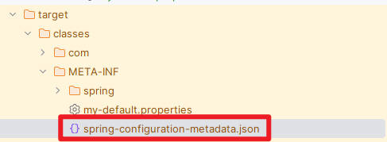

### 制作镜像
```bash
docker build -t go-server:v1.0 .
```
### 服务启动命令
```shell
nohup /opt/jdk-17.0.10/bin/java -Xms1024m  -jar /opt/app/client/client-service.jar >/dev/null 2>&1 &
nohup /opt/jdk-17.0.10/bin/java -Xms1024m  -jar /opt/app/server/grpc-service.jar >/dev/null 2>&1 &
```
### arthas下载启动
```shell
#下载
curl -O https://arthas.aliyun.com/arthas-boot.jar
#启动
/opt/jdk-17.0.10/bin/java -Xms1024m -jar /opt/app/arthas-boot.jar
#打印帮助信息
/opt/jdk-17.0.10/bin/java -Xms1024m -jar /opt/app/arthas-boot.jar -h
```
