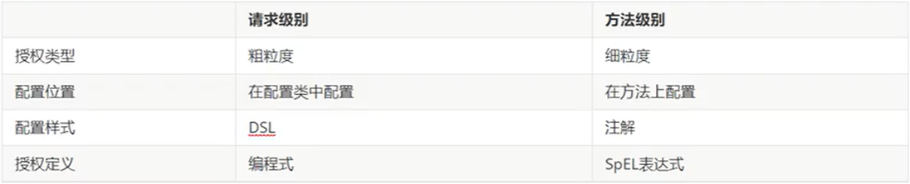

# spring-security-server项目

>- 基于请求的：在配置文件中配置路径，可以使用**的通配符
>- 基于方法的：在方法上使用注解
>- 动态权限的：在数据库中配置权限，权限更新后自动刷新

## 请求级别和方法级别对比
如果方法上也定义了权限，则会覆盖类上的权限；
使用注解方式，未注解的方法安全，需要在HttpSecurity实例中声明兜底授权规则。



## 基于请求的
OneSecurityConfig.kt配置类：
```kotlin
package com.go.config

import org.springframework.context.annotation.Bean
import org.springframework.context.annotation.Configuration
import org.springframework.security.config.annotation.web.builders.HttpSecurity
import org.springframework.security.config.annotation.web.configuration.EnableWebSecurity
import org.springframework.security.core.userdetails.User
import org.springframework.security.core.userdetails.UserDetailsService
import org.springframework.security.crypto.factory.PasswordEncoderFactories
import org.springframework.security.crypto.password.PasswordEncoder
import org.springframework.security.provisioning.InMemoryUserDetailsManager
import org.springframework.security.web.SecurityFilterChain

/**
 * 基于请求鉴权
 */
@Configuration
@EnableWebSecurity(debug = true)
class OneSecurityConfig {
    // 密码加密器
    @Bean
    fun passwordEncoder(): PasswordEncoder {
        return PasswordEncoderFactories.createDelegatingPasswordEncoder()
    }

    // 自定义用户名和密码
    @Bean
    fun userDetailsService(passwordEncoder: PasswordEncoder): UserDetailsService {
        var user1 = User.withUsername("admin")
            .password(passwordEncoder.encode("tiger"))
            .roles("admin", "user")
            .authorities("test:show")
            .build()
        var user2 = User.withUsername("gjw")
            .password(passwordEncoder.encode("tiger"))
            .roles("user")
            .build()
        return InMemoryUserDetailsManager().apply {
            createUser(user1)
            createUser(user2)
        }
    }

    // 定义一个过滤器链，该链能够与 HttpServletRequest. 匹配，以确定它是否适用于该请求
    @Bean
    fun securityFilterChain(http: HttpSecurity): SecurityFilterChain {
        // 关闭csrf机制
        http.csrf { it.disable() }
        // 配置拦截方式-基于请求的授权
        http.authorizeHttpRequests { auth ->
            // to_login 接口允许任意访问（未登录也可访问）
            auth.requestMatchers("/to_login").permitAll()
                // has_admin 接口，登陆用户必须有 admin 角色
                .requestMatchers("/has_admin").hasRole("admin")
                // has_any 接口，登陆用户必须有 admin 或 user 角色
                .requestMatchers("/has_any").hasAnyRole("admin", "user")
                // has_authority 接口，登陆用户必须有 'test:show' 权限
                .requestMatchers("/has_authority").hasAuthority("test:show")
                // 其他请求 登陆即可访问
                .anyRequest().authenticated()
        }
        // 默认的登陆配置
        //http.formLogin(Customizer.withDefaults())
        // 覆盖原有的登陆配置
        http.formLogin {
            it.loginPage("/to_login")//跳转到指定登陆页
                .loginProcessingUrl("/doLogin")//处理前端的请求与form表单一致
                .usernameParameter("username") //用户名
                .passwordParameter("password") //密码
                .defaultSuccessUrl("/index") //
        }
        return http.build()
    }
}
```
OneController.kt控制器：
```kotlin
package com.go.controller

import org.springframework.web.bind.annotation.GetMapping
import org.springframework.web.bind.annotation.RequestMapping
import org.springframework.web.bind.annotation.RestController

@RestController
@RequestMapping
class OneController {

    @GetMapping("test")
    fun index(): String {
        return "Hello World"
    }

    @GetMapping("has_admin")
    fun hasAdmin(): String {
        return "admin 角色有访问权限"
    }
    @GetMapping("has_any")
    fun hasAny(): String {
        return "admin或user 角色有访问权限"
    }
    @GetMapping("has_authority")
    fun hasAuthority(): String {
        return "具有 ‘Authority’权限可以访问"
    }
}
```
PageController.kt控制器：
```kotlin
@Controller
class PageController {
    @GetMapping("to_login")
    fun toLogin(): String {
        println("跳转到登陆页面")
        return "login"
    }

    @GetMapping("index")
    fun index(): String {
        println("跳转到index页面")
        return "index"
    }
}
```
## 基于方法的
TwoSecurityConfig.kt配置类：
```kotlin
/**
 * 基于方法鉴权
 */
@Configuration
@EnableMethodSecurity
class TwoSecurityConfig {
    // 密码加密器
    @Bean
    fun passwordEncoder(): PasswordEncoder {
        return PasswordEncoderFactories.createDelegatingPasswordEncoder()
    }

    // 自定义用户名和密码
    @Bean
    fun userDetailsService(passwordEncoder: PasswordEncoder): UserDetailsService {
        var user1 = User.withUsername("admin")
            .password(passwordEncoder.encode("tiger"))
            .roles("admin", "user")
            .authorities("test:show", "user:name", "user:list")
            .build()
        var user2 = User.withUsername("gjw")
            .password(passwordEncoder.encode("tiger"))
            .roles("user")
            .build()
        return InMemoryUserDetailsManager().apply {
            createUser(user1)
            createUser(user2)
        }
    }

    // 定义一个过滤器链，该链能够与 HttpServletRequest. 匹配，以确定它是否适用于该请求
    @Bean
    fun securityFilterChain(http: HttpSecurity): SecurityFilterChain {
        // 关闭csrf机制
        http.csrf { it.disable() }
        // 配置拦截方式-基于请求的授权
        http.authorizeHttpRequests { auth ->
            // to_login 接口允许任意访问（未登录也可访问）
            auth.requestMatchers("/to_login").permitAll()
                // 其他请求 登陆即可访问
                .anyRequest().authenticated()
        }
        // 默认的登陆配置
        //http.formLogin(Customizer.withDefaults())
        // 覆盖原有的登陆配置
        http.formLogin {
            it.loginPage("/to_login")//跳转到指定登陆页
                .loginProcessingUrl("/doLogin")//处理前端的请求与form表单一致
                .usernameParameter("username") //用户名
                .passwordParameter("password") //密码
                .defaultSuccessUrl("/index") //
        }
        return http.build()
    }
}
```
TwoController.kt控制器：
```kotlin
package com.go.controller

import org.springframework.security.access.prepost.PostAuthorize
import org.springframework.security.access.prepost.PostFilter
import org.springframework.security.access.prepost.PreAuthorize
import org.springframework.security.access.prepost.PreFilter
import org.springframework.web.bind.annotation.GetMapping
import org.springframework.web.bind.annotation.RequestMapping
import org.springframework.web.bind.annotation.RestController

/**
 * 基于方法鉴权
 */
@RestController
@RequestMapping
class TwoController {
    /**
     * @PreAuthorize注解调用方法前，判断是否有权限
     * 作用：使用类或者方法上，拥有指定权限才可以访问
     * String类型参数：语法是spring的el表达式,hasRole中的权限字符为 Authority加ROLE_前缀规则；
     */
    @PreAuthorize("hasAuthority('test:show') || hasAuthority('test:show2')")
    @GetMapping("/m_1")
    fun preAuthorizeHasAuthority(): String {
        return "preAuthorizeHasAuthority，基于方法鉴权，测试@PreAuthorize注解"
    }

    /**
     * @PostAuthorize 方法返回时校验，返回用户名，如果用户名的长度大于3位认为是合法的
     * returnObject:是固定写法，就是返回值对象
     */
    @PreAuthorize("hasAuthority('user:name')")
    @PostAuthorize("returnObject.length() > 3")
    @GetMapping("/m_2")
    fun postAuthorizeHasAuthority(): String {
        return "preAuthorizeHasAuthority，基于方法鉴权，测试@PostAuthorize注解,方法返回时校验"
    }

    /**
     * @PostFilter：过滤符合条件的数据返回
     * 返回结果集中元素的长度大于3的数据
     */
    @PreAuthorize("hasAuthority('user:list')")
    @PostFilter("filterObject.length() > 3")
    @GetMapping("/m_3")
    fun postFilter(): List<String> {
        return mutableListOf("admin", "gjw", "tiger", "12")
    }

    /**
     * @PreFilter：过滤符合条件的数据进入到接口，数据必须是Collection、map、Array类型数组
     */
    @PreAuthorize("hasAuthority('user:list')")
    @PreFilter("returnObject.length() > 3")
    @GetMapping("/m_4")
    fun preFilter(): List<String> {
        return mutableListOf("admin", "gjw", "tiger", "12")
    }
}
```
## 动态权限鉴权
### 集成JWT
```xml
<!-- JWT -->
<dependency>
    <groupId>io.jsonwebtoken</groupId>
    <artifactId>jjwt</artifactId>
    <version>0.9.1</version>
</dependency>
<!-- JWT JDK8以上需要加入以下依赖 -->
<dependency>
    <groupId>javax.xml.bind</groupId>
    <artifactId>jaxb-api</artifactId>
    <version>2.3.1</version>
</dependency>
```
JwtUtils.kt
```kotlin
package com.go.security

import io.jsonwebtoken.Claims
import io.jsonwebtoken.Jwts
import io.jsonwebtoken.SignatureAlgorithm
import java.util.*

/**
 * Jwt工具类
 */
class JwtUtils {
    companion object {
        private const val EXPIRE_TIME: Long = 1000 * 60 * 60 * 24 * 7 // 过期时间 7天
        private const val SECRET: String = "dskfks3hfowifei3*t978" // 秘钥

        /**
         * 生成token
         */
        fun createToken(map: MutableMap<String, Any>): String {
            return Jwts.builder()
                .setClaims(map)
                .setIssuedAt(Date())//创建 JWT 时的时间戳
                .setExpiration(Date(System.currentTimeMillis() + EXPIRE_TIME))
                .signWith(SignatureAlgorithm.HS256, SECRET)// 设置签名
                .compact()
        }

        /**
         * 根据token解析出用户信息
         * @exception io.jsonwebtoken.ExpiredJwtException token过期异常
         */
        fun parseToken(token: String): Claims {
            return Jwts.parser()
                .setSigningKey(SECRET)
                .parseClaimsJws(token)
                .body
        }
    }
}
```
JwtAuthFilter.kt过滤器：
```kotlin
package com.go.security.filter

import com.go.mapper.domain.User
import com.go.security.JwtUtils
import com.go.security.MockData
import jakarta.servlet.FilterChain
import jakarta.servlet.http.HttpServletRequest
import jakarta.servlet.http.HttpServletResponse
import org.springframework.security.authentication.UsernamePasswordAuthenticationToken
import org.springframework.security.core.context.SecurityContextHolder
import org.springframework.stereotype.Component
import org.springframework.web.filter.OncePerRequestFilter

/**
 * 捕获请求头中的token，解析token，获取用户信息
 *
 * 1、获取到用户信息，告知 springSecurity ，springSecurity 会根据访问的接口进行鉴权；
 * 2、告知springSecurity 就是使用Authentication告知框架，springSecurity 会将信息放到SecurityContextHolder中->SecurityContextHolder;
 *
 */
@Component
class JwtAuthFilter : OncePerRequestFilter() {

    override fun doFilterInternal(
        request: HttpServletRequest,
        response: HttpServletResponse,
        filterChain: FilterChain
    ) {
        val token = request.getHeader(MockData.TOKEN_HEADER)
        //login接口不需要校验token，直接放行，因为后边还有其他的过滤器
        if (token == null) {
            doFilter(request, response, filterChain)
            return
        }
        //解析token
        val data = JwtUtils.parseToken(token)
        //获取到用户信息, 放入到SecurityContext中
        val user = User().apply {
            loginName = data.get("loginName", String::class.java)
            userId = data["userId"].toString().toLong()
            perms = (data["perms"] as MutableList<String>).toMutableSet()
        }
        val authenticationToken = UsernamePasswordAuthenticationToken(user, null, user.authorities)
        SecurityContextHolder.getContext().authentication = authenticationToken
        // 放行
        doFilter(request, response, filterChain)
    }
}
```

ThreeSecurityConfig.kt配置类：
>- 将过滤器添加到过滤器链中,放置在 用户名密码认证过滤器之前
```kotlin
package com.go.config

import com.go.security.filter.JwtAuthFilter
import jakarta.annotation.Resource
import org.springframework.context.annotation.Bean
import org.springframework.context.annotation.Configuration
import org.springframework.security.authentication.AuthenticationManager
import org.springframework.security.authentication.ProviderManager
import org.springframework.security.authentication.dao.DaoAuthenticationProvider
import org.springframework.security.config.annotation.method.configuration.EnableMethodSecurity
import org.springframework.security.config.annotation.web.builders.HttpSecurity
import org.springframework.security.config.annotation.web.configuration.EnableWebSecurity
import org.springframework.security.core.userdetails.UserDetailsService
import org.springframework.security.crypto.factory.PasswordEncoderFactories
import org.springframework.security.crypto.password.PasswordEncoder
import org.springframework.security.web.SecurityFilterChain
import org.springframework.security.web.authentication.UsernamePasswordAuthenticationFilter

/**
 * 动态权限鉴权
 */
@Configuration
@EnableMethodSecurity
class ThreeSecurityConfig {

    @Resource
    private lateinit var userDetailsService: UserDetailsService

    @Resource
    private lateinit var jwtAuthFilter: JwtAuthFilter

    /**
     * AuthenticationManager：负责认证
     * DaoAuthenticationProvider：负责将userDetailsService、passwordEncoder融合起来送到AuthenticationManager中
     */
    @Bean
    fun authenticationManager(passwordEncoder: PasswordEncoder): AuthenticationManager {
        val provider = DaoAuthenticationProvider()
        provider.setUserDetailsService(userDetailsService)
        // 关联使用的密码加密器
        provider.setPasswordEncoder(passwordEncoder)
        // 将provider放置进AuthenticationManager中
        return ProviderManager(provider)
    }

    // 密码加密器
    @Bean
    fun passwordEncoder(): PasswordEncoder {
        return PasswordEncoderFactories.createDelegatingPasswordEncoder()
    }

    // 定义一个过滤器链，该链能够与 HttpServletRequest. 匹配，以确定它是否适用于该请求
    @Bean
    fun securityFilterChain(http: HttpSecurity): SecurityFilterChain {
        // 关闭csrf机制
        http.csrf { it.disable() }
        // 配置拦截方式-基于请求的授权
        http.authorizeHttpRequests { auth ->
            // to_login 接口允许任意访问（未登录也可访问）
            auth.requestMatchers("/auth/login").permitAll()
                // 其他请求 登陆即可访问
                .anyRequest().authenticated()
        }
        // 将过滤器添加到过滤器链中,放置在 用户名密码认证过滤器之前
        http.addFilterBefore(jwtAuthFilter, UsernamePasswordAuthenticationFilter::class.java)
        return http.build()
    }
}
```
