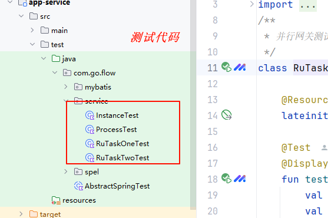

# Flow工作流
## 支持功能
- 流程定义
- [X] 部署流程定义JSON数据
- [X] 停用流程定义
- [X] 启用流程定义
- 流程实例
- [X] 支持用户任务节点
- [X] 支持排他网关
- [X] 支持并行网关
- [X] 支持包容网关
- [X] 支持流程开始和结束事件回调
- [X] 流程关闭
- [X] 下游节点人员变更
- [ ] 动态新增节点
- [ ] 动态删减节点

- 运行任务实例
- [X] 任务查询
- [X] 支持任务节点开始事件回调
- [X] SPEL表达式支持
- [X] 领取任务
- [X] 归还任务
- [ ] 任务回退任意节点
- [ ] 任务跳转任意节点

## 核心类说明

流程定义实体：[ProcessDefinition](./spring-starter-demo/src/main/java/com/go/starter/core/model/ProcessDefinition.kt)  
流程引擎上下文：[FlowContext](./spring-starter-demo/src/main/java/com/go/starter/core/FlowContext.kt)  
流程涉及枚举：[FlowEnum](./spring-starter-demo/src/main/java/com/go/starter/core/enums/FlowEnum.kt)

## 测试代码

## 流程定义示例

```json
{
  "processName": "流程名",
  "processKey": "请假流程_v1",
  "instanceListener": "com.go.flow.MyProcessListener",
  "nodes": [
    {
      "nodeId": "_start",
      "nodeName": "开始节点",
      "nodeType": "START",
      "targetRef": "n_0"
    },
    {
      "nodeId": "n_0",
      "nodeName": "班主任审批",
      "nodeType": "USER_TASK",
      "formKey": "com.sx.flow.FormA1",
      "targetRef": "n_1",
      "assignee": "#user_1",
      "candidateUsers": "#n_0_user",
      "taskListener": "com.go.flow.MyTaskListener"
    },
    {
      "nodeId": "n_1",
      "nodeName": "班主任审批",
      "nodeType": "USER_TASK",
      "formKey": "com.sx.flow.FormA1",
      "targetRef": "gateway_1",
      "assignee": "#user_1",
      "candidateUsers": "#n_1_user",
      "taskListener": "com.go.flow.MyTaskListener"
    },
    {
      "nodeId": "gateway_1",
      "nodeName": "排他网关",
      "nodeType": "PAI_TA_GATEWAY",
      "flowConditions": [
        {
          "nodeId": "n_2",
          "conExpression": "T(Integer).parseInt(#leaveDays) <= 7"
        },
        {
          "nodeId": "n_3",
          "conExpression": "T(Integer).parseInt(#leaveDays) > 7"
        }
      ]
    },
    {
      "nodeId": "n_2",
      "nodeName": "总理审批（请假小于等于7天）",
      "nodeType": "USER_TASK",
      "formKey": "com.sx.flow.FormA1",
      "targetRef": "_end",
      "assignee": "#user_1",
      "candidateUsers": "#n_2_user",
      "taskListener": "com.go.flow.MyTaskListener"
    },
    {
      "nodeId": "n_3",
      "nodeName": "主席审批（请假大于7天）",
      "nodeType": "USER_TASK",
      "formKey": "com.sx.flow.FormA1",
      "targetRef": "_end",
      "assignee": "#user_1",
      "candidateUsers": "#n_3_user",
      "taskListener": "com.go.flow.MyTaskListener"
    },
    {
      "nodeId": "_end",
      "nodeName": "结束节点",
      "nodeType": "END"
    }
  ]
}
```

## 调试脚本

```bash
#清空表SQL
TRUNCATE TABLE fw_his_instance;
TRUNCATE TABLE fw_his_task;
TRUNCATE TABLE fw_his_variable;
TRUNCATE TABLE fw_instance_ext;
#TRUNCATE TABLE fw_process;
TRUNCATE TABLE fw_ru_task;
TRUNCATE TABLE fw_ru_variable;
```