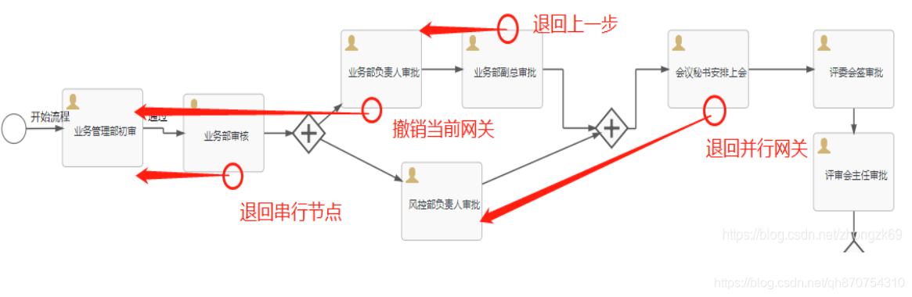
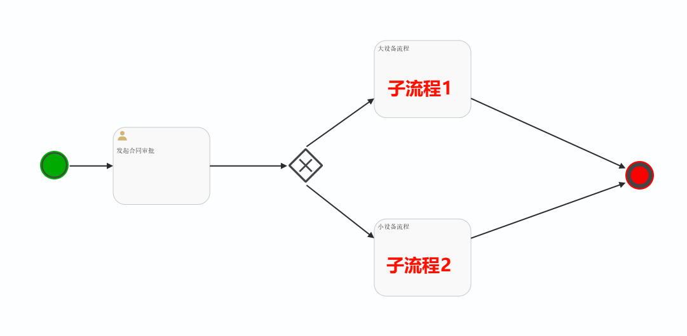
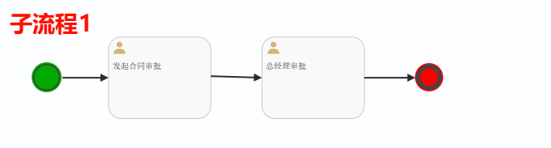
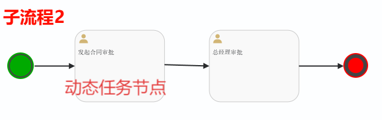
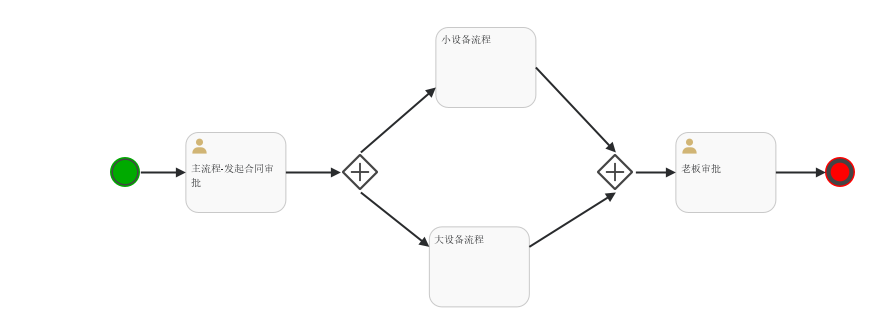

# flowable驳回/退回上一步/退回到


## 一、驳回/退回上一步/退回到（历史某一个节点）fff
```text
我们经常需要工作流中退回上一步，或者退回历史某一个节点。但由于流程的场景是很复杂的，回退有以下一些场景：
```

1.串行路线上的退回：流程中没有任何网关（排他网关/并行网关）和会签多实例。

2.退回到并行网关分支中的某一个节点上：

3.并行网关中的某一个分支节点上发起退回，退回到并行网关前面的某一个节点上

4.子流程中退回到主干流程中某一个节点/主干流程退回到子流程中某一个节点。

如下图：


## 二、flowable实现：
### 回退
1.普通串行路线上的退回（此流程中没有并行网关的退回时），此方法支持普通串行节点/会签多实例节点/排他网关节点：
```java
runtimeService.createChangeActivityStateBuilder()
        .processInstanceId(proInstanceId)
        .moveActivityIdsToSingleActivityId(curTaskKeys, targetTaskKey)
        .changeState();
        或者
        moveActivityIdTo(String currentActivityId,String newActivityId)；
```

2.并行网关中发起退回（即撤销当前的网关）,这个地方不能用moveActivityIdTo(String currentActivityId,String newActivityId)；是因为当某一个分支完成，它的is_active为0，另一条分支没有完成时。这时候这个方法是取不到所的分支的key的，它只有is_active为1的key能取到，不然就会造成多一条垃圾数据，同时再走并行时，任何一个分支不会等另一个分支就完走到分支的合并节点上，这就是bug，所以要改为以下方法：
```java
// 并行网关的退回
List currentExecutionIds = new ArrayList<>();
List executions = runtimeService.createExecutionQuery().parentId(proInstanceId).list();
for (Execution execution : executions) {
    System.out.println(“并行网关节点数：”+execution.getActivityId());
    currentExecutionIds.add(execution.getId());
}
runtimeService.createChangeActivityStateBuilder()
    .moveExecutionsToSingleActivityId(currentExecutionIds, targetTaskKey)
    .changeState();
```
3.退回到并行网关中的某一个节点：经试验退回时必须同时退回并行网关中的所有分支。
```java
List targetTaskKeys = new ArrayList<>();
targetTaskKeys.add(“sid-CA74ADED-7E70-451D-951C-95988BFC3F07”);
targetTaskKeys.add(“sid-7922C598-74FD-4848-95AC-D9790AF68432”);

runtimeService.createChangeActivityStateBuilder()
    .processInstanceId(proInstanceId)
    .moveSingleActivityIdToActivityIds(“sid-CAD50E6F-7E0C-437D-816B-DDBA1A976A79”, targetTaskKeys)
    .changeState();
```
4.主干流程和子流程的退回（没有试验过），官方提供了以下方法：
```java
moveActivityIdToParentActivityId(String currentActivityId, String newActivityId)
moveActivityIdToSubProcessInstanceActivityId(String currentActivityId, String newActivityId, String callActivityId)
moveActivityIdToSubProcessInstanceActivityId(String currentActivityId, String newActivityId, String callActivityId,Integer subProcessDefinitionVersion)
```
原文链接：https://blog.csdn.net/zhongzk69/article/details/90740662
### 事务和任务监听器
```xml
<userTask id="createBill" name="创建请假单" flowable:candidateUsers="${dagongzai}">
  <extensionElements>
    <flowable:taskListener event="create" delegateExpression="${my03TaskListener}"/><!-- 事务中，执行的任务监听器 -->
    <flowable:taskListener event="create" delegateExpression="${my03TransactionCommittedTaskListener}" onTransaction="committed"/><!-- 事务提交后，执行的任务监听器 -->
    <flowable:taskListener event="create" delegateExpression="${my03TransactionRolledBackTaskListener}" onTransaction="rolled-back"/><!-- 事务回滚后，执行的任务监听器 -->
  </extensionElements>
</userTask>
```
### 子流程
#### 流程图：




#### 核心配置：
- 主流程 [spring-call-activity.bpmn20.xml](src/main/resources/spring-call-activity.bpmn20.xml)
```xml
<process id="spring_call_activity" name="子流程调用" isExecutable="true">
    <extensionElements>
      <!-- 设置流程的业务版本 -->
      <flowable:executionListener event="start" expression="${execution.setVariable('_processVersion', 'v1.0')}"/>
    </extensionElements>
    
    <userTask id="createBill" name="发起合同审批" flowable:assignee="${dagongzai}">
        <extensionElements>
            <flowable:taskListener event="create" delegateExpression="${my03TaskListener}"/>
            <!-- 事务中，执行的任务监听器 -->
            <flowable:taskListener event="create" delegateExpression="${my03TransactionCommittedTaskListener}" onTransaction="committed"/>
            <!-- 事务提交后，执行的任务监听器 -->
            <flowable:taskListener event="create" delegateExpression="${my03TransactionRolledBackTaskListener}" onTransaction="rolled-back"/>
            <!-- 事务回滚后，执行的任务监听器 -->
        </extensionElements>
    </userTask>
    <!-- 子流程1 -->
    <callActivity id="sub_one" name="大设备流程" calledElement="spring_sub_one">
        <extensionElements>
            <!-- 向子流程传递变量 -->
            <flowable:in target="objInfo" source="objInfo"/>
            <flowable:in target="dagongzai" source="b_dagongzai"/>
        </extensionElements>
    </callActivity>
    <!--
      子流程2:
     flowable:calledElementType="id" 表示调用的子流程是通过id来引用的
     calledElement="${spring_sub_two_process_id}" 表示调用的子流程是通过变量来引用的 processDefinitionId
     -->
    <callActivity id="sub_two" name="小设备流程" calledElement="${spring_sub_two_process_id}" flowable:calledElementType="id">
        <extensionElements>
            <!-- 向子流程传递变量 -->
            <flowable:in target="objInfo" source="objInfo"/>
            <flowable:in target="dagongzaiList" source="s_dagongzaiList"/>
        </extensionElements>
    </callActivity>
</process>
```
- 子流程2[spring-sub-two.bpmn20.xml](src/main/resources/spring-sub-two.bpmn20.xml)
```xml
<userTask id="createBill" name="发起合同审批" flowable:assignee="${dagongzai}">
  <extensionElements>
    <flowable:taskListener event="create" delegateExpression="${my03TaskListener}"/>
    <!-- 事务中，执行的任务监听器 -->
    <flowable:taskListener event="create" delegateExpression="${my03TransactionCommittedTaskListener}" onTransaction="committed"/>
    <!-- 事务提交后，执行的任务监听器 -->
    <flowable:taskListener event="create" delegateExpression="${my03TransactionRolledBackTaskListener}" onTransaction="rolled-back"/>
    <!-- 事务回滚后，执行的任务监听器 -->
  </extensionElements>
  <!-- 动态人员审核 -->
  <multiInstanceLoopCharacteristics isSequential="false" flowable:collection="${dagongzaiList}" flowable:elementVariable="dagongzai">
    <completionCondition><![CDATA[${nrOfInstances == nrOfCompletedInstances}]]></completionCondition>
  </multiInstanceLoopCharacteristics>
</userTask>
```

### 主流程+多个子流程且子流程是多实例

>- smallDevices 和 bigDevices 是两个集合变量，分别存储小设备和大设备的信息，为空时，流程会自动跳过子流程，进入下一个节点任务。
>- 子流程被关闭后，也认为为完成继续下一个节点任务。

- 主流程 [spring-call-activity.bpmn20.xml](src/main/resources/spring-call-activity.bpmn20.xml)
```xml
<process id="spring_call_activity" name="子流程调用" isExecutable="true">
    <documentation>子流程调用</documentation>
    <extensionElements>
        <!-- 设置流程的业务版本 -->
        <flowable:executionListener event="start" expression="${execution.setVariable('_processVersion', 'v1.0')}"/>
    </extensionElements>
    <startEvent id="startEvent1" flowable:formFieldValidation="true"/>
    <userTask id="createBill" name="主流程-发起合同审批" flowable:assignee="${dagongzai}">
        <extensionElements>
            <flowable:taskListener event="create" delegateExpression="${my03TaskListener}"/>
            <!-- 事务中，执行的任务监听器 -->
            <flowable:taskListener event="create" delegateExpression="${my03TransactionCommittedTaskListener}" onTransaction="committed"/>
            <!-- 事务提交后，执行的任务监听器 -->
            <flowable:taskListener event="create" delegateExpression="${my03TransactionRolledBackTaskListener}" onTransaction="rolled-back"/>
            <!-- 事务回滚后，执行的任务监听器 -->
        </extensionElements>
    </userTask>
    <sequenceFlow id="sid-409F929D-E529-4C99-8735-95803943879E" sourceRef="startEvent1" targetRef="createBill"/>
    <!-- 子流程 -->
    <!--
      子流程:
     flowable:calledElementType="id" 表示调用的子流程是通过id来引用的
     calledElement="${spring_sub_two_process_id}" 表示调用的子流程是通过变量来引用的 processDefinitionId（控制主子流程版本）
     -->
    <callActivity id="sub_small" name="小设备流程" calledElement="${spring_sub_two_process_id}" flowable:calledElementType="id">
        <extensionElements>
            <!-- ********************************************************* -->
            <flowable:in source="device" target="deviceInfo"/>
            <!-- 通过变量传递父级实例ID -->
            <flowable:in source="${execution.processInstanceId}" target="parentProcessInstanceId"/>
        </extensionElements>
        <multiInstanceLoopCharacteristics flowable:collection="${smallDevices}" flowable:elementVariable="device"></multiInstanceLoopCharacteristics>
    </callActivity>
    <callActivity id="sub_big" name="大设备流程" calledElement="${spring_sub_one_process_id}" flowable:calledElementType="id">
        <extensionElements>
            <!-- ********************************************************* -->
            <!-- 向子流程传递变量 -->
            <flowable:in source="device" target="deviceInfo"/>
            <!-- 通过变量传递父级实例ID -->
            <flowable:in source="${execution.processInstanceId}" target="parentProcessInstanceId"/>
        </extensionElements>
        <multiInstanceLoopCharacteristics flowable:collection="${bigDevices}" flowable:elementVariable="device"></multiInstanceLoopCharacteristics>
    </callActivity>
    <endEvent id="_endNode"/>
    <sequenceFlow id="sid-fafd20e0-00ca-490c-8b23-33a0d9d429d9" sourceRef="createBill" targetRef="p_gateway_start"/>
    <userTask id="end_boos" name="老板审批"/>
    <sequenceFlow id="sid-668a2279-597d-4a6b-8c9b-46071f9670c7" sourceRef="sub_small" targetRef="p_gateway_end"/>
    <sequenceFlow id="sid-69dc6ebd-6ee4-4309-8ed4-de41183b29a3" sourceRef="end_boos" targetRef="_endNode"/>
    <parallelGateway id="p_gateway_start"/>
    <sequenceFlow id="sid-7e2673c9-ac62-41e5-8401-82793eaae6d7" sourceRef="p_gateway_start" targetRef="sub_small">
        <conditionExpression xsi:type="tFormalExpression"/>
    </sequenceFlow>

    <sequenceFlow id="sid-5a22986e-1d66-4ddf-b54d-cb37f1629d07" sourceRef="p_gateway_start" targetRef="sub_big">
        <conditionExpression xsi:type="tFormalExpression"/>
    </sequenceFlow>
    <parallelGateway id="p_gateway_end"/>
    <sequenceFlow id="sid-77ae039c-cbd0-4689-b65a-aa3971d2b454" sourceRef="sub_big" targetRef="p_gateway_end"/>
    <sequenceFlow id="sid-7b557569-ad09-40c1-8292-a8972d443691" sourceRef="p_gateway_end" targetRef="end_boos">
        <conditionExpression xsi:type="tFormalExpression"/>
    </sequenceFlow>
</process>
```

