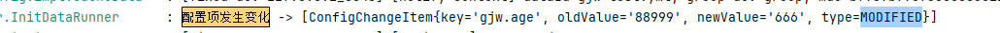

# nacos集成
## maven坐标
```xml
<properties>
    <maven.compiler.source>17</maven.compiler.source>
    <maven.compiler.target>17</maven.compiler.target>
    <project.build.sourceEncoding>UTF-8</project.build.sourceEncoding>

    <os.maven.plugin.version>1.7.1</os.maven.plugin.version>
    <com.google.protobuf.version>3.25.1</com.google.protobuf.version>
    <protobuf.maven.plugin.version>0.6.1</protobuf.maven.plugin.version>

    <spring-boot.version>3.0.2</spring-boot.version>
    <spring-cloud-alibaba.version>2022.0.0.0-RC2</spring-cloud-alibaba.version>
</properties>

 <dependencyManagement>
    <dependencies>
        <dependency>
            <groupId>org.springframework.boot</groupId>
            <artifactId>spring-boot-dependencies</artifactId>
            <version>${spring-boot.version}</version>
            <type>pom</type>
            <scope>import</scope>
        </dependency>
        <dependency>
            <groupId>com.alibaba.cloud</groupId>
            <artifactId>spring-cloud-alibaba-dependencies</artifactId>
            <version>${spring-cloud-alibaba.version}</version>
            <type>pom</type>
            <scope>import</scope>
        </dependency>
    </dependencies>
</dependencyManagement>
```
## 配置文件
```yaml
spring:
  application:
    name: nacos-config-example
  cloud:
    nacos:
      config:
        username: nacos
        password: nacos
        server-addr: 127.0.0.1:8848
        namespace: dev
        enable-remote-sync-config: true
  config:
    import:
      - nacos:gjw-test.yml?refreshEnabled=true&group=dev-group
      - nacos:groovy_script?refreshEnabled=true&group=dev_group
```
## Nacos配置中心配置


## 动态更新配置值 @RefreshScope
```java
@Setter
@Getter
@Configuration
@RefreshScope
public class AppConfig {
    @Value("${gjw.test}")
    private String value;
}
```
## 注入ConfigService实例bean
- 注入ConfigService实例bean
```java
@Setter
@Getter
@Configuration
@RefreshScope
public class AppConfig {
    @Value("${gjw.test}")
    private String value;

    @Resource
    private NacosConfigManager nacosConfigManager;

    @Bean
    public ConfigService getConfigService() {
        return nacosConfigManager.getConfigService();
    }
}
```
- 用于获取nacos配置文件整体内容
```java
@Slf4j
@Component
public class TextListener {
    @Resource
    private ConfigService configService;

    public String getConfigContent(String dataId, String group) {
        try {
            return configService.getConfig(dataId, group, 5000);
        } catch (NacosException e) {
            log.error("获取配置失败", e);
            return null;
        }
    }
}
```
## 测试
```java
@RestController
@RequestMapping("/nacos")
public class NacosTestController {
    @Resource
    private AppConfig appConfig;
    @Resource
    private TextListener textListener;

    @GetMapping
    public String test() {
        return "hello nacos " + appConfig.getValue();
    }

    @Scheduled(cron = "0/2 * * * * ?")
    public void test2() {
        System.out.println("配置项 gjw.test -> " + appConfig.getValue());
        System.out.println("脚本内容 -> "+textListener.getConfigContent("groovy_script","dev_group"));
    }
}
```
- 效果  


# 配置变更监控
## 配置项监控 & 配置文件内容监控
```java
package com.go.groovy.runner;

import com.alibaba.nacos.api.config.ConfigChangeEvent;
import com.alibaba.nacos.api.config.ConfigChangeItem;
import com.alibaba.nacos.api.config.ConfigService;
import com.alibaba.nacos.client.config.listener.impl.AbstractConfigChangeListener;
import com.go.groovy.listener.NacosConfigChangeListener;
import jakarta.annotation.Resource;
import lombok.extern.slf4j.Slf4j;
import org.springframework.boot.CommandLineRunner;
import org.springframework.stereotype.Component;

import java.util.Collection;

@Component
@Slf4j
public class InitDataRunner implements CommandLineRunner {
    @Resource
    private ConfigService configService;

    @Override
    public void run(String... args) throws Exception {
        //监控配置文件变化
        configService.addListener("groovy_script", "dev_group", new NacosConfigChangeListener());
        //监控配置项变化
        afterPropertiesSet();
    }


    public void afterPropertiesSet() throws Exception {
        AbstractConfigChangeListener listener =
                new AbstractConfigChangeListener() {
                    @Override
                    public void receiveConfigChange(ConfigChangeEvent event) {
                        Collection<ConfigChangeItem> changeItems = event.getChangeItems();
                        log.info("配置项发生变化 -> {}", changeItems.toString());
                    }
                };
        configService.addListener("gjw-test.yml", "dev-group", listener);
    }
}
```
### 监控配置文件变更监听器
```java
package com.go.groovy.listener;

import com.alibaba.nacos.api.config.listener.Listener;

import java.util.concurrent.Executor;

public class NacosConfigChangeListener implements Listener {
    @Override
    public Executor getExecutor() {
        return null;
    }

    @Override
    public void receiveConfigInfo(String configInfo) {
        System.out.println("监听到脚本变化 = " + configInfo);
    }
}
```
### 控制台效果



