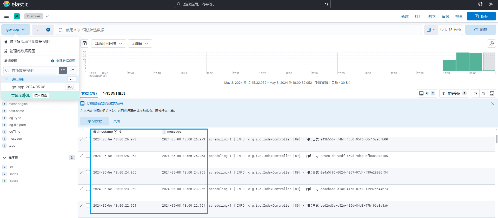

## 制作镜像
```bash
docker build -t go-server:v1.0 .
```
## 创建网络
```shell
docker network create elk
```
## es docker安装
```shell
docker run -d --name es01 --net elk -p 9200:9200 --privileged=true -m 1GB -v .\es\config:/usr/share/elasticsearch/config docker.elastic.co/elasticsearch/elasticsearch:8.13.1
```
## kibana docker安装
```shell
docker run -d --name kib01 --net elk -p 5601:5601 --privileged=true -v .\kibana\config:/usr/share/kibana/config docker.elastic.co/kibana/kibana:8.13.1
```
## logstash docker安装
```shell
docker run -d --name lg01 --net elk -p 5044:5044 -v .\logstash\config:/usr/share/logstash/config -v .\logstash\pipeline:/usr/share/logstash/pipeline -v D:\work\logs:/logs docker.elastic.co/logstash/logstash:8.13.1
```
### logstash-file.conf
```yaml
input {
    file {
        path => ["/logs/*.log"]
        tags => "go-app"
        add_field => {
            log_type => "one"
        }
    }
}
filter {
    if [log_type] == "one" {
        mutate {
            add_field => {
                "[@metadata][target_index]" => "go-app-%{+YYYY.MM.dd}"
            }
        }
    } else {
        mutate {
            add_field => {
                "[@metadata][target_index]" => "unknown-%{+YYYY.MM.dd}"
            }
        }
    }
    # 是@timestamp的值使用日志中匹配到的时间值
    #深入理解 ELK 中 Logstash 的底层原理 + 填坑指南 https://server.51cto.com/article/710561.html
    #Kibana 自带 grok 的正则匹配的工具 http://127.0.0.1:5601/app/dev_tools#/grokdebugger
    grok{
        match => {"message" => "(?<logTime>\d{4}-\d{2}-\d{2}\s\d{2}:\d{2}:\d{2}.\d{3})"}
    }
    date {
      match => ["logTime", "yyyy-MM-dd HH:mm:ss.SSS"]
      timezone => "Asia/Shanghai"
      target => "@timestamp"
    }
}
output {
    stdout {}
    elasticsearch {
        hosts => "es01:9200"
        index => "%{[@metadata][target_index]}"
    }
}
```



