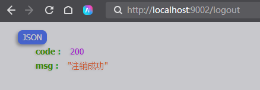

# Oauth2.0自定义登陆（gitee）使用默认登陆页面

## gitee上创建应用
> Client ID：4acc995f3b994fe11d5cca9c4d2a942211afd732c391fc6da739bb5274dd22af  
> Client Secret：55b243f5af4f8238d23c7233d6b3263aaa6ade6b7cd67b43026c9cf7a7169b09  
> 应用回调地址：http://localhost:9002/oauth/notify
## OAuth2 认证基本流程

## 获取用户信息


## 退出登陆
### 退出登陆成功处理器LogoutSuccessHandler
```kotlin
package com.go.security.handler

import cn.hutool.json.JSONUtil
import com.go.common.extension.log
import jakarta.servlet.http.HttpServletRequest
import jakarta.servlet.http.HttpServletResponse
import org.springframework.security.core.Authentication
import org.springframework.security.web.authentication.logout.LogoutSuccessHandler

/**
 * 退出登陆处理器
 */
class GoLogoutSuccessHandler:LogoutSuccessHandler {
    override fun onLogoutSuccess(
        request: HttpServletRequest,
        response: HttpServletResponse,
        authentication: Authentication?
    ) {
        // todo 执行业务操作，清除cookie,记录退出日志,清除用户缓存等
        log.info(" 执行业务操作，清除cookie,记录退出日志,清除用户缓存等")
        response.characterEncoding = "UTF-8"
        response.writer.write(JSONUtil.toJsonStr(mapOf("code" to 200, "msg" to "注销成功")))
    }
}
```
### SecurityConfig配置
```kotlin
package com.go.config

import com.go.security.handler.GoLogoutSuccessHandler
import org.springframework.context.annotation.Bean
import org.springframework.context.annotation.Configuration
import org.springframework.security.config.Customizer
import org.springframework.security.config.annotation.method.configuration.EnableMethodSecurity
import org.springframework.security.config.annotation.web.builders.HttpSecurity
import org.springframework.security.core.userdetails.User
import org.springframework.security.core.userdetails.UserDetailsService
import org.springframework.security.crypto.factory.PasswordEncoderFactories
import org.springframework.security.crypto.password.PasswordEncoder
import org.springframework.security.provisioning.InMemoryUserDetailsManager
import org.springframework.security.web.SecurityFilterChain

/**
 * 动态权限鉴权
 */
@Configuration
@EnableMethodSecurity
class SecurityConfig {
    // 自定义用户名和密码
    @Bean
    fun userDetailsService(passwordEncoder: PasswordEncoder): UserDetailsService {
        var user1 = User.withUsername("admin")
            .password(passwordEncoder.encode("tiger"))
            .roles("admin", "user")
            .authorities("test:show")
            .build()
        var user2 = User.withUsername("gjw")
            .password(passwordEncoder.encode("tiger"))
            .roles("user")
            .build()
        return InMemoryUserDetailsManager().apply {
            createUser(user1)
            createUser(user2)
        }
    }

    // 密码加密器
    @Bean
    fun passwordEncoder(): PasswordEncoder {
        return PasswordEncoderFactories.createDelegatingPasswordEncoder()
    }

    // 定义一个过滤器链，该链能够与 HttpServletRequest. 匹配，以确定它是否适用于该请求
    @Bean
    fun securityFilterChain(http: HttpSecurity): SecurityFilterChain {
        // 关闭csrf机制
        http.csrf { it.disable() }
        // 配置拦截方式-基于请求的授权
        http.authorizeHttpRequests { auth ->
            auth.requestMatchers("/oauth/notify").permitAll()
                .anyRequest().authenticated()
        }
        // 使用默认登陆页面
        http.formLogin(Customizer.withDefaults())
        // 开启oauth2登陆
        http.oauth2Login(Customizer.withDefaults())
        // 退出登陆
        http.logout { it.logoutSuccessHandler(GoLogoutSuccessHandler()).deleteCookies("rememberMe").permitAll() }
        return http.build()
    }
}
```
### 效果图
