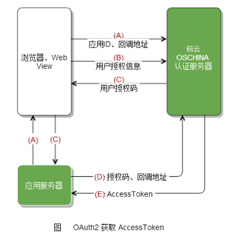
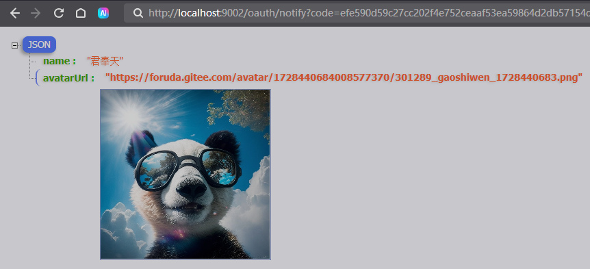

# Oauth2.0自定义登陆（gitee）使用自定义登陆页面

## gitee上创建应用
> Client ID：4acc995f3b994fe11d5cca9c4d2a942211afd732c391fc6da739bb5274dd22af  
> Client Secret：55b243f5af4f8238d23c7233d6b3263aaa6ade6b7cd67b43026c9cf7a7169b09  
> 应用回调地址：http://localhost:9002/oauth/notify
## OAuth2 认证基本流程

## 获取用户信息



## 配置gitee的授权登陆信息
```kotlin
@Bean
fun clientRegistrationRepository(): ClientRegistrationRepository {
    return InMemoryClientRegistrationRepository(giteeClientRegistration())
}

// 配置gitee的授权登陆信息
private fun giteeClientRegistration(): ClientRegistration {
    return ClientRegistration.withRegistrationId("gitee")
        .clientId("4acc995f3b994fe11d5cca9c4d2a942211afd732c391fc6da739bb5274dd22af")
        .clientSecret("55b243f5af4f8238d23c7233d6b3263aaa6ade6b7cd67b43026c9cf7a7169b09")
        .clientAuthenticationMethod(ClientAuthenticationMethod.CLIENT_SECRET_BASIC)
        .authorizationGrantType(AuthorizationGrantType.AUTHORIZATION_CODE)
        .redirectUri("http://localhost:9002/oauth/notify")
        .scope("user_info")
        .authorizationUri("https://gitee.com/oauth/authorize")
        .tokenUri("https://gitee.com/oauth/token")
        .userInfoUri("https://gitee.com/api/v5/user")
        .userNameAttributeName("name")
        .build()
}
```