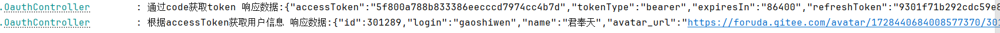

# Oauth2.0自定义登陆（gitee）使用默认登陆页面

## gitee上创建应用
> Client ID：4acc995f3b994fe11d5cca9c4d2a942211afd732c391fc6da739bb5274dd22af  
> Client Secret：55b243f5af4f8238d23c7233d6b3263aaa6ade6b7cd67b43026c9cf7a7169b09  
> 应用回调地址：http://localhost:9002/oauth/notify
## OAuth2 认证基本流程

## 获取用户信息

